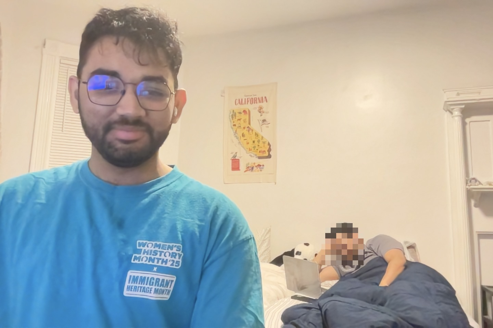
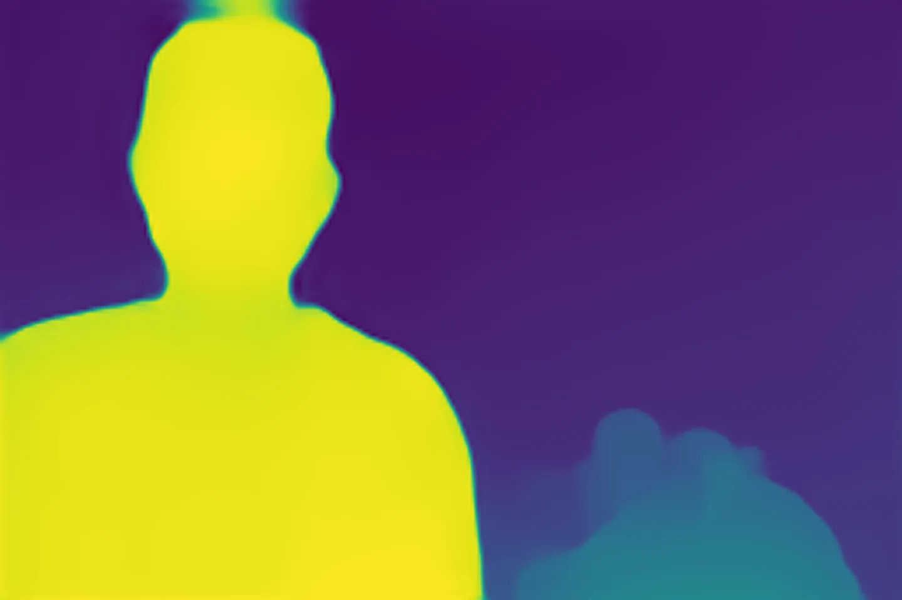
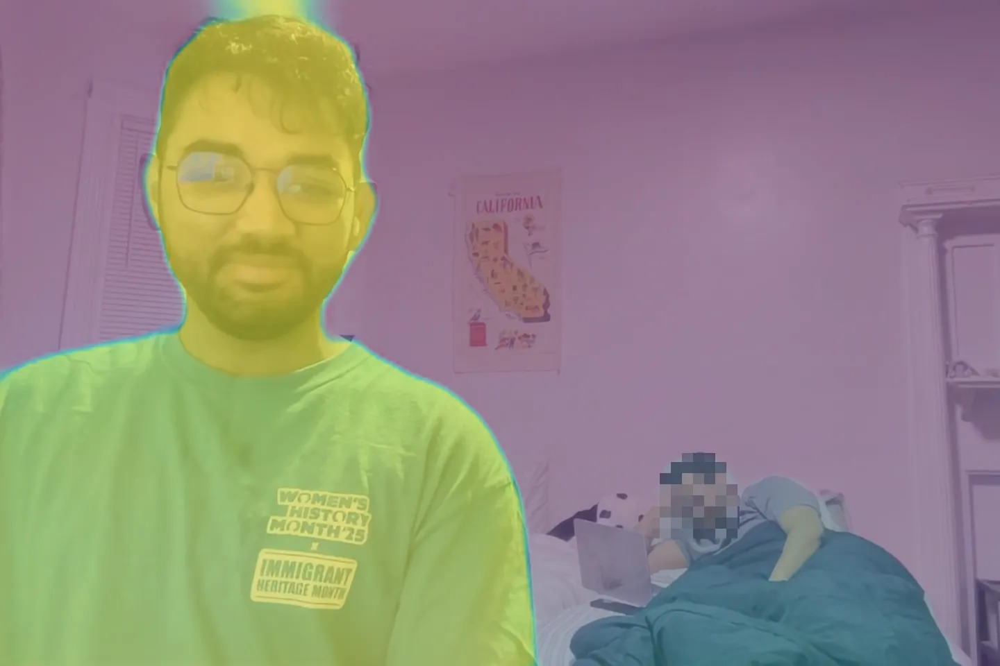
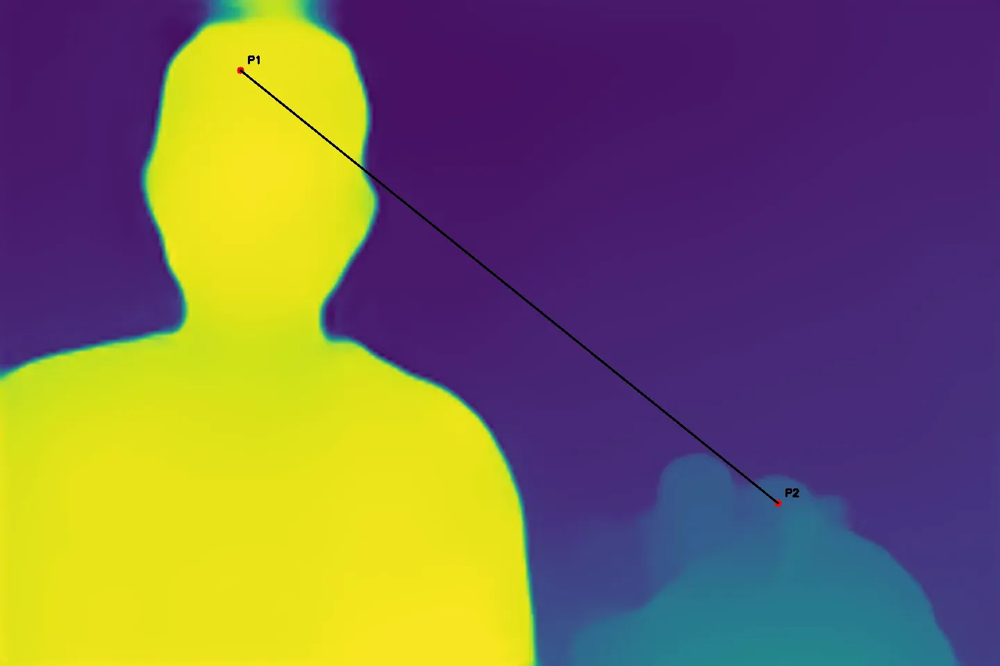
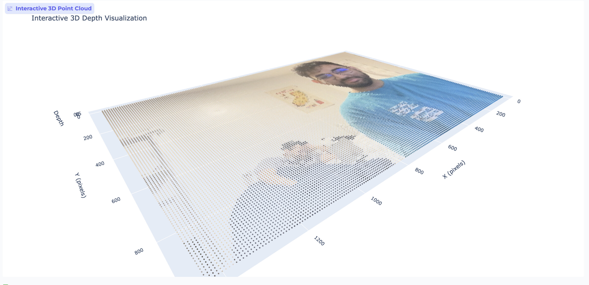

# Vision-Based 3D Measurement & Perception Tool

An ML-driven perception system that converts 2D images into 3D spatial understanding using monocular depth estimation. Built with MiDaS depth models and optimized for GPU inference.

## Demo Gallery

| Input + Depth (Side-by-Side) | Depth Visualization |
| --- | --- |
|  |  |

| Depth Overlay | Point-to-Point Measurement | 3D Point Cloud |
| --- | --- | --- |
|  |  |  |

## Overview

This project demonstrates computer vision and machine learning techniques for spatial perception without requiring depth sensors or specialized hardware. It uses pretrained depth estimation models to:

- Generate dense depth maps from single RGB images
- Measure relative distances between points in 3D space
- Perform scale calibration using reference objects
- Process images, videos, and real-time webcam feeds
- Export structured outputs (depth maps, measurements, metadata)

Perfect for AR/ML research, robotics perception, and computer vision portfolios.

## Features

- **Monocular Depth Estimation**: Uses MiDaS models (DPT_Large, DPT_Hybrid, MiDaS_small)
- **GPU-Optimized**: H100/A100 support with mixed precision (FP16) and TF32
- **Multiple Input Modes**: Single images, batch processing, video files, webcam
- **3D Measurements**: Point-to-point distances, object-level measurements, scale calibration
- **Rich Visualizations**: Colorized depth maps, overlays, 3D point clouds
- **Structured Exports**: JSON metadata, CSV data, PNG depth maps
- **Flexible Configuration**: YAML-based configuration system

## Installation

### Prerequisites

- Python 3.9+
- CUDA-capable GPU (optional, but recommended for performance)
- macOS with Apple Silicon or Linux/Windows with NVIDIA GPU

### Setup

1. Clone the repository:
```bash
git clone https://github.com/MayankTamakuwala/Vision-Based-3D-Measurement-Perception-Tool.git
cd Vision-Based-3D-Measurement-Perception-Tool
```

2. Create and activate virtual environment:
```bash
python3 -m venv .venv
source .venv/bin/activate  # On Windows: .venv\Scripts\activate
```

3. Install dependencies:
```bash
pip install -r requirements.txt
```

4. Install in development mode:
```bash
pip install -e .
```

### Optional Dependencies

For development tools:
```bash
pip install -r requirements-dev.txt
```

For web UI (Streamlit/Gradio):
```bash
pip install -r requirements-ui.txt
```

## Quick Start

### Single Image Depth Estimation

```bash
# Activate virtual environment
source .venv/bin/activate

# Process a single image
python scripts/run_single_image.py path/to/image.jpg -o output/ -m DPT_Large

# With custom colormap
python scripts/run_single_image.py image.jpg -o output/ -c plasma
```

### Batch Processing

```bash
# Process all images in a directory
python scripts/run_batch.py input_dir/ -o output/ -m DPT_Hybrid -c viridis

# Process with custom pattern
python scripts/run_batch.py input_dir/ -p "*.png" -o output/
```

### Measurement Demo

```bash
# Run measurement demonstrations
python scripts/measurement_demo.py image.jpg -o measurements/
```

### Video Processing

```bash
# Process video file
python scripts/run_video.py video.mp4 -o output/ -m MiDaS_small

# Sample every 5th frame
python scripts/run_video.py video.mp4 -s 5 --save-frames
```

### Real-Time Webcam

```bash
# Real-time depth estimation (press 'q' to quit)
python scripts/run_webcam.py --camera 0 -m MiDaS_small

# Save recording
python scripts/run_webcam.py --save-recording output.mp4
```

### Web User Interfaces

For interactive exploration, we provide both Gradio and Streamlit web interfaces.

**Install UI dependencies first:**
```bash
pip install -r requirements-ui.txt
```

**Gradio Demo (Quick Interactive Demo):**
```bash
# Launch Gradio interface
python app/gradio_app.py

# Features:
# - Upload and process images
# - Interactive model selection
# - Click-to-measure distances
# - 3D point cloud visualization
# - Real-time parameter adjustments

# Access at: http://localhost:7860
```

**Streamlit Dashboard (Full-Featured Application):**
```bash
# Launch Streamlit dashboard
streamlit run app/streamlit_app.py

# Features:
# - Multi-page application
# - Single image processing
# - Measurement tools (distance, calibration, objects)
# - 3D visualization with multiple views
# - Depth profile analysis
# - Export capabilities (PNG, JSON, PLY)

# Access at: http://localhost:8501
```

**Web UI Capabilities:**
- 🎯 Interactive image upload and processing
- 📏 Point-and-click distance measurement
- 🎯 Scale calibration with known references
- 🔍 Object detection from depth maps
- 🌐 Interactive 3D point clouds with Plotly
- 📊 Real-time depth profile analysis
- 💾 Export results in multiple formats

## Project Structure

<!-- ```
Vision-Based-3D-Measurement-Perception-Tool/
├── config/                    # YAML configurations
├── src/
│   ├── core/                 # Core depth estimation engine
│   ├── preprocessing/        # Input handling
│   ├── postprocessing/       # Depth processing
│   ├── measurement/          # Distance/measurement engine
│   ├── visualization/        # Visual outputs
│   ├── export/              # Output formats
│   └── utils/               # Utilities (logger, validators, metrics)
├── scripts/                  # CLI tools
├── app/                      # Web UI (Streamlit/Gradio)
├── tests/                    # Testing suite
├── data/                     # Data directories
├── notebooks/                # Jupyter demos
└── docs/                     # Documentation
``` -->
```
Vision-Based-3D-Measurement-Perception-Tool/
├── config/                    # YAML configurations
├── src/
│   ├── core/                 # Core depth estimation engine
│   ├── preprocessing/        # Input handling
│   ├── postprocessing/       # Depth processing
│   ├── measurement/          # Distance/measurement engine
│   ├── visualization/        # Visual outputs
│   ├── export/              # Output formats
│   └── utils/               # Utilities (logger, validators, metrics)
├── scripts/                  # CLI tools
├── app/                      # Web UI (Streamlit/Gradio)
├── tests/                    # Testing suite
├── data/                     # Data directories
└── docs/                     # Documentation
```

## Testing

### Running Tests

```bash
# Run all tests
pytest

# Run specific test categories
pytest -m unit          # Unit tests only
pytest -m integration   # Integration tests
pytest -m performance   # Performance tests

# Run with coverage
pytest --cov=src --cov-report=html

# Run specific test file
pytest tests/test_core/test_depth_estimator.py

# Verbose output
pytest -v
```

### Test Structure

```
tests/
├── conftest.py              # Fixtures and configuration
├── test_core/               # Core module tests
│   ├── test_device_manager.py
│   └── test_depth_estimator.py
├── test_measurement/        # Measurement tests
│   └── test_distance_calculator.py
└── test_integration/        # End-to-end tests
    └── test_pipeline.py
```

### Test Coverage

- Unit tests for all core modules
- Integration tests for complete workflows
- Performance benchmarks
- GPU-specific tests (when available)

## Documentation

- **[Architecture Guide](docs/ARCHITECTURE.md)** - System design and module structure
- **[User Guide](docs/USER_GUIDE.md)** - Comprehensive usage examples
<!-- - **[Quickstart Notebook](notebooks/01_quickstart.ipynb)** - Interactive tutorial -->

## Configuration

The project uses YAML-based configuration files in the `config/` directory:

- `default.yaml`: Main configuration (model, device, paths)
- `model_config.yaml`: Model-specific settings
- `device_config.yaml`: GPU/device optimization settings

You can also use environment variables (see `.env.example`).

## Performance

Target performance on H100 GPU:
- Single image (384x384): <50ms inference
- Batch processing (16 images): >100 FPS
- Webcam mode: 30+ FPS at 640x480

## Tech Stack

- **Core**: Python, PyTorch, OpenCV, NumPy
- **Models**: MiDaS (Intel ISL), timm
- **Visualization**: Matplotlib, Plotly
- **UI**: Streamlit, Gradio (optional)
- **Testing**: pytest, pytest-cov

## License

MIT License - see LICENSE file for details

## Acknowledgments

- MiDaS depth estimation by Intel ISL
- PyTorch Hub for model distribution
- Open source computer vision community

<!-- ## Contributing

Contributions welcome! Please open an issue or submit a pull request. -->

<!-- ## Citation

If you use this project in your research, please cite:

```bibtex
@software{vision3d2025,
  title={Vision-Based 3D Measurement & Perception Tool},
  author={Mayank Devangkumar Tamakuwala},
  year={2025},
  url={https://github.com/yourusername/Vision-Based-3D-Measurement-Perception-Tool}
}
```

## Contact

For questions or collaboration opportunities, please open an issue on GitHub. -->
